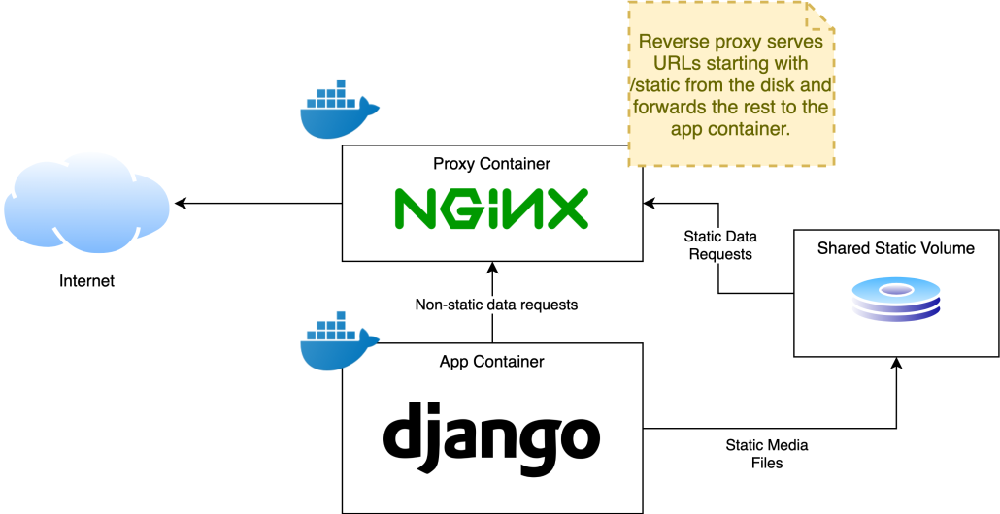

# django-project-template
Django project template with docker and docker-compose included for easy development.
This repo is inspried by london app developer [blog](https://londonappdeveloper.com/deploying-django-with-docker-compose/ "deploying django with docker compose").

### **I. Commands to run**
1. Build the docker image:

    ```shell
    docker-compose build
    ```

2. Create new django project from the docker image:

    ```shell
    docker-compose run --rm app sh -c "django-admin startproject django_project ."
    ```
    > Creates an django project named **django_project** inside docker image

3. Create new django app from the docker image:

    ```shell
    docker-compose run --rm app sh -c "python manage.py startapp django_app"
    ```
    > Creates an django app named **django_app** inside docker image

4. add migrations after defining the models:

    ```shell
    docker-compose run --rm app sh -c "python manage.py makemigrations"
    ```

- - - 
### **II. Add Changes to project settings.py and urls.py**
1. Do the following changes to settings.py

    ```python
    import os
    SECRET_KEY = os.environ.get('SECRET_KEY')
    DEBUG = bool(int(os.environ.get('DEBUG', 0)))

    ALLOWED_HOSTS = []
    ALLOWED_HOSTS.extend(
        filter(
            None,
            os.environ.get('ALLOWED_HOSTS', '').split(','),
        )
    )

    DATABASES = {
        'default': {
            'ENGINE': 'django.db.backends.postgresql',
            'HOST': os.environ.get('DB_HOST'),
            'NAME': os.environ.get('DB_NAME'),
            'USER': os.environ.get('DB_USER'),
            'PASSWORD': os.environ.get('DB_PASS'),
        }
    }
    STATIC_URL = '/static/static/'
    MEDIA_URL = '/static/media/'

    MEDIA_ROOT = '/vol/web/media'
    STATIC_ROOT = '/vol/web/static'
    ```
2. Add the following code to urls.py

    ```python
    from django.conf.urls.static import static
    from django.conf import settings

    if settings.DEBUG:
        urlpatterns += static(
            settings.MEDIA_URL,
            document_root=settings.MEDIA_ROOT,
        )
    ```
- - -
### **III. Adding proxy to the project**

